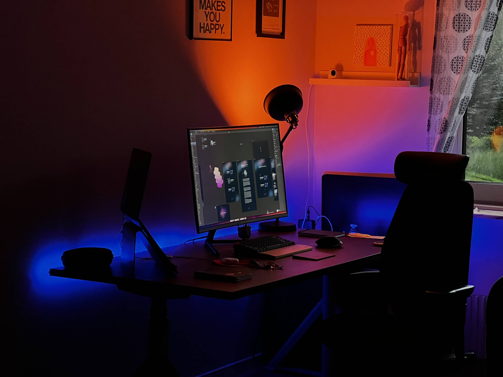
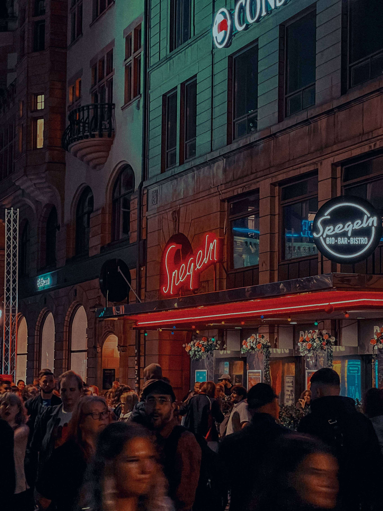

Hi, I’m Ayman.

I came to design from a background in Web Development. I wrote my first line of code back in 2013. At that time, I had no idea what UX design was until 2017 when I worked for a startup that created a streaming platform. A friend of mine handed me a book about UX design. It was poorly translated to Arabic from English, but that poorly translated book was the beginning of something I had never thought of. 

<figure class="img-wrapper">
    
</figure>

In 2017, I enrolled in college to study Information Systems, however after a year, I couldn’t see the added value of college, so I dropped choosing to focus on my career and continue what I have started with the experience that already had built. I believe by the time you read this, I already have over six years of experience in the field, had a couple of positions in respectful companies, worked on tons of different kinds of projects, and still probably work for a lead hardware company called Ubiquiti.

You can see my ex-lives [here in my CV](https://read.cv/aymanuz).
<figure class="img-wrapper">
    
</figure>
<em>Here's where I spend most of my day.</em>

I’m based in Sweden now, living with my lovely wife and daughter, and sure still exploring this land with its endless probabilities. There are some feelings you can't describe, but you can show. Here are some of those:

<figure class="img-wrapper overflow-x-auto xl:overflow-hidden w-[90vw] xl:w-[90vw] md:w-[90vw]">
    

        

        
        

        

        
        

        

        
        

        

        
        

    

</figure>