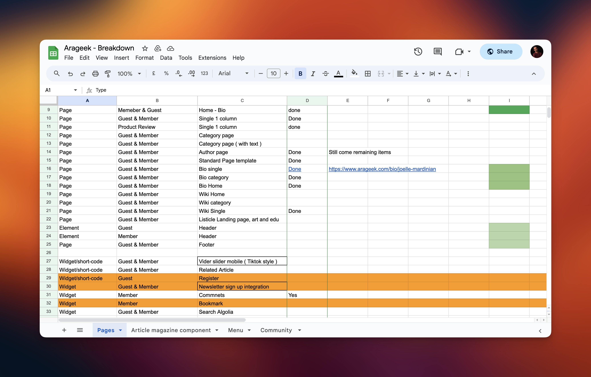
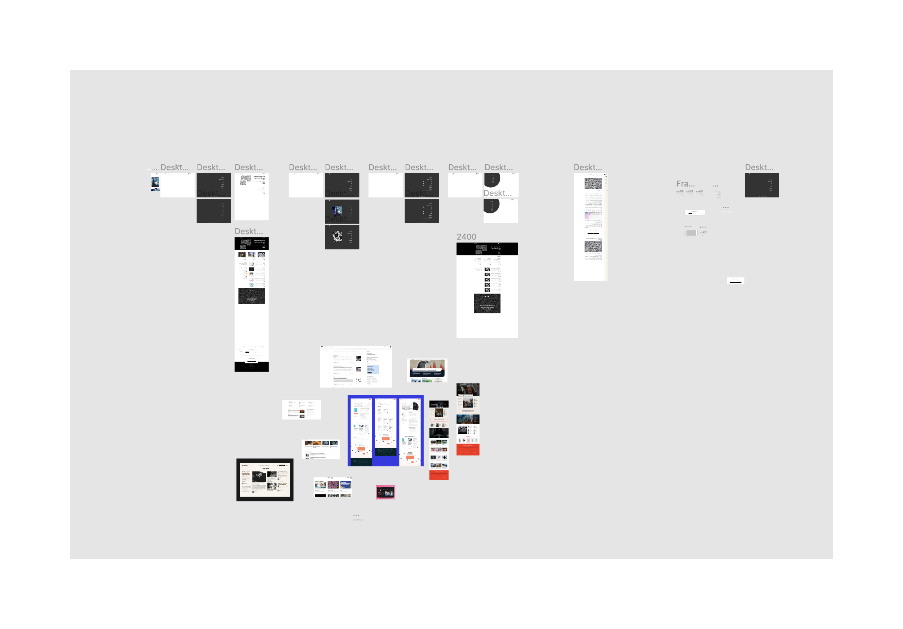
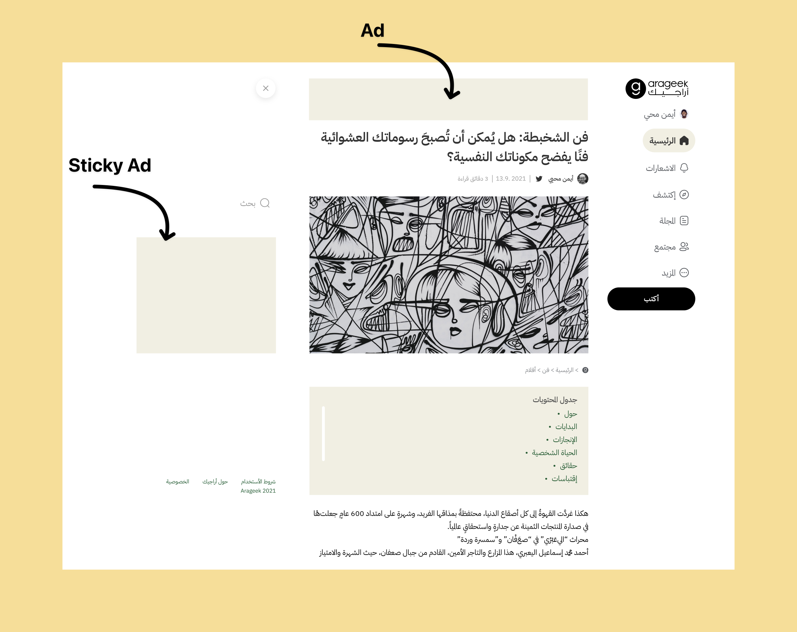

Arageek is one of the first Arabic online magazines to offer engaging and relevant content focused on technology and social media news to Arab youth. It covers a wide range of topics, including Technology news and reviews, Social media trends, Gaming, Science and education, Entrepreneurship and more.

It is known for its high-quality writing and its ability to make complex topics accessible to a wide audience. It has a loyal readership of millions of people across the Arab world. In addition to its website, Arageek also has a strong presence on social media, with over 3 million followers on Facebook, Twitter, and Instagram. 

In 2023, Arageek is still one of the most popular and influential digital media websites in the Arab world. It continues to provide its readers with engaging and informative content on the latest trends and also produces a weekly podcast and several video series.

### Goals & Challenges
The reasons for doing a whole redesign were the following:
- Increase user engagement with the content
- Faster performance
- Better Ads engagement  
- Better Aesthetics

Yet the biggest challenge was how to use a single web application (React on NextJS) to give users a native browsing experience, especially on mobile.

### Design Process

First, we initiated a breakdown for the Website. We defined every page, section and widget that needed to be added, removed or enhanced to make a better experience for the readers and meet their expectations.

<figure class="img-wrapper">
    
</figure>

#### Initial Ideas & Wireframes

In this project, I got wild with exploring the ideas that we can use. I threw sketches and initial interactions here and there to see what could stick. I attempted to investigate the potential structure and layout of certain views, acknowledging that the final order and positioning of elements had not been determined.

<figure class="img-wrapper">
    
</figure>

<figure class="img-wrapper">
    <video playsinline="" autobuffer="" autoplay="" muted="" loop="" poster="" class="max-w-[800px] w-[90vw]">
    <source src="nav.mp4" type="video/mp4">
    </video>
</figure>

#### Improving Architecture

A pain point that required immediate attention was the complex navigation structure, characterized by an abundance of categories and sub-categories within a single location. This intricacy hindered seamless navigation across various pages, resulting in decreased user engagement with the content. Recognizing the need for improvement and the introduction of new pages, we seized the opportunity to comprehensively restructure the navigation system. Our approach involved prioritizing the most frequently visited categories, streamlining the user experience by focusing on the most essential elements.

<figure class="img-wrapper">
    
</figure>

### Evolation

As Arageek marked a departure from conventional magazine design, it provided a strategic opening to introduce innovative design patterns, including depth, animation, and enhanced accessibility features. The intent was to gradually implement these design elements across the entirety of the website, paving the way for a more modern and cohesive user experience.

<figure class="img-wrapper">
    <video playsinline="" autobuffer="" autoplay="" muted="" loop="" poster="" class="max-w-[1500px] w-[90vw]">
    <source src="Cards.mp4" type="video/mp4">
    </video>
</figure>

<figure class="img-wrapper">
    <video playsinline="" autobuffer="" autoplay="" muted="" loop="" poster="" class="max-w-[400px] w-[90vw]">
    <source src="bio-card.mp4" type="video/mp4">
    </video>
</figure>

### Bring It All Together

Given that a significant majority of our users access articles via mobile devices, prioritizing mobile optimization was imperative. During our analysis, it became evident that a limited selection of one or two article layouts for browsing appeared to be somewhat monotonous. Consequently, we have developed a variety of modular components tailored for diverse sections to enhance the user experience.

<figure class="img-wrapper">
    
</figure>

Given that advertising serves as the primary source of revenue for Arageek, we recognized an opportunity to exercise greater control and decision-making over their placement, timing, and presentation, rather than merely embedding them into the design post facto.

<figure class="img-wrapper">
    
</figure>