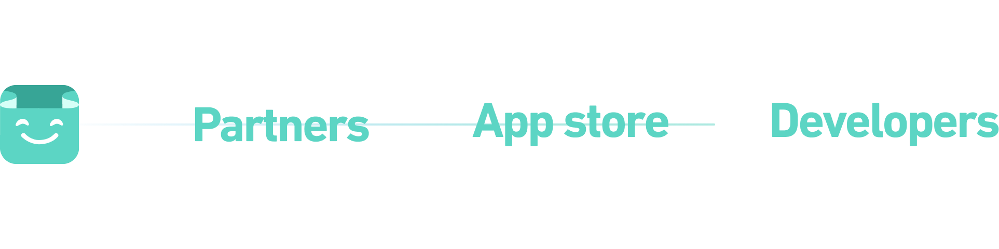
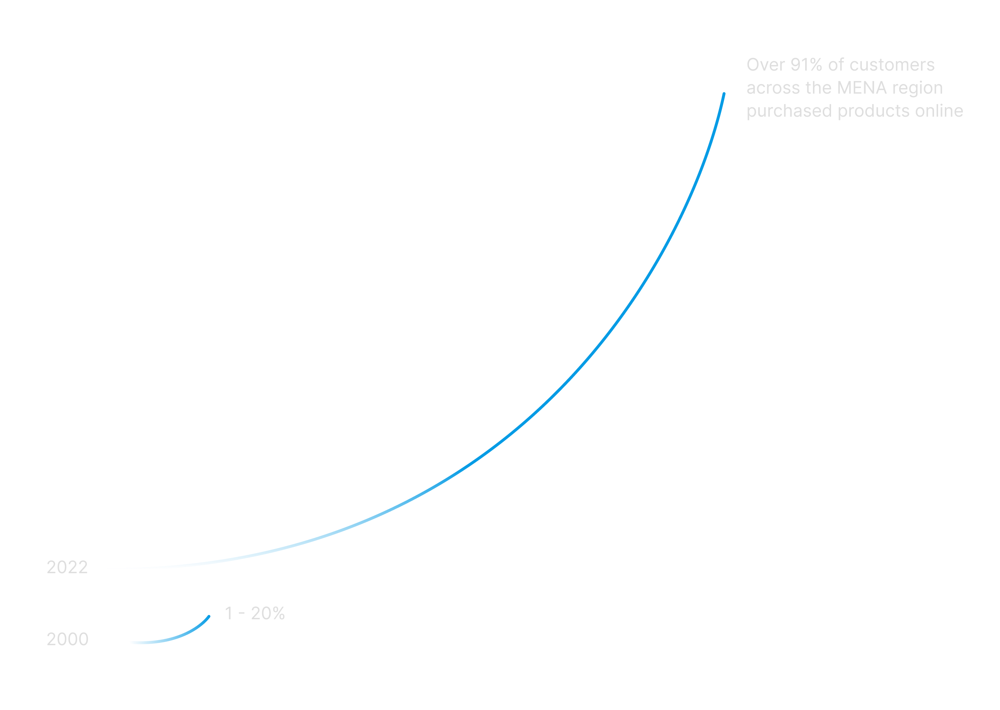

###### About Salla & Salla Dev
Salla is the largest Saudi e-commerce platform in the Middle East that empowers you to initiate, manage, and expand your entrepreneurial venture, equipped with comprehensive support and advanced functionalities essential for achieving success in your business journey.

The Salla Developer Portal is a website that provides developers with the resources they need to build apps and themes for the Salla e-commerce platform using the Salla Partners program. The portal includes documentation on the Salla APIs, code samples, tutorials, and a community forum where developers can collaborate and ask questions.

<figure class="img-wrapper">
    
</figure>

## My Role
When I worked with Salla at first, I was only hired as a freelancer to build the Salla Developer Portal. Yet then I ended up hired with a full-time position to build Salla Partners and Salla App Store also.

I collaborated with an amazing project manager, CTO and an additional lead designer to explore insights and transform ideas into functionalities that cater to customer behaviors and motivations. I developed frameworks and prototypes to communicate the vision and design principles, which played a crucial role in promoting concepts, achieving consensus, and influencing decision-making. I also crafted and presented designs to secure approval from executives, senior stakeholders, and various other teams within Salla at different stages of the project.

THE CHALLANGE
 
<h2 class="realtive group mt-0"> Make a deeper connection with <del>customers</del> developers</h2>
The growing e-commerce market is creating a lot of opportunities for developers. Developers are in high demand to build and maintain e-commerce websites and applications, and they are also needed to develop new features and functionality for e-commerce platforms.

<figure class="img-wrapper mt-9">
    
</figure>

So our challenge was to create the perfect environment that developers need for designing, developing, and maintaining e-commerce apps and themes to be successful in the growing e-commerce market.

<figure class="img-wrapper">
    
</figure>

To expedite market entry, we were assigned the task of designing and constructing Salla Partners within the pre-existing E-Commerce development environment. This approach was seen as advantageous and the least risky option. This initial architectural decision significantly influenced our ability to deliver a high-quality customer experience.

The confluence of a set launch date and ambitious project scope created a demanding environment fraught with coordination and timing obstacles. Working in reverse from the fixed launch date meant that design took a backseat to an engineering-driven process. Project milestones were determined by engineering estimates, and the time allocated for design was what remained after other tasks were completed. The combination of a set launch date and an expansive scope resulted in a challenging and time-sensitive atmosphere.

Just because engineers will use, doesn’t mean it has to be mundane. Consequently, developing a contemporary and distinctive visual style became a top priority. This entailed refining cards, fundamental UI elements such as shadows, and essential components, all of which were heavily reliant on the design systems I established. The quality of the user interface played a pivotal role in the platform.

