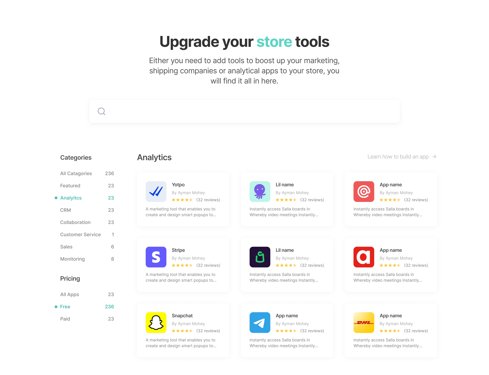

###### About Salla & Salla Dev
[Salla](https://salla.com/) is the largest Saudi e-commerce platform in the Middle East that empowers developers to initiate, manage, and expand their entrepreneurial venture, equipped with comprehensive support and advanced functionalities essential for achieving success in their business journey.

The [Salla Developer](https://salla.dev) Portal is a platform that provides developers with the resources they need to [build apps](https://apps.salla.sa/en) and themes for the Salla e-commerce platform using the [Salla Partners](https://salla.partners/) platform. The portal includes documentation on the Salla APIs, code samples, tutorials, and a community forum where developers can collaborate and ask questions.

<figure class="img-wrapper">
    
</figure>

## My Role
When I worked with Salla at first, I was only hired as a freelancer to build the Salla Developer Portal. Yet then, I ended up hired with a full-time position to design Salla Partners, Salla Developer Portal, and Salla App Store.

I collaborated with an amazing project manager, CTO and an additional lead designer to explore insights and transform ideas into functionalities that cater to customer behaviors and motivations. I developed frameworks and prototypes to communicate the vision and design principles, which played a crucial role in promoting concepts, achieving consensus, and influencing decision-making. I also crafted and presented designs to secure approval from executives, senior stakeholders, and various other teams within Salla at different stages of the project.

THE CHALLENGE
 
<h2 class="realtive group mt-0"> Make a deeper connection with <del>customers</del> developers</h2>

[The growing e-commerce market](https://virtocommerce.com/blog/ecommerce-in-middle-east-gcc#:~:text=eCommerce%20in%20Middle%20East%20statistics,savvy%20and%20accept%20paying%20digitally.) is creating a lot of opportunities for developers. They are in high demand to build and maintain e-commerce  websites, applications as well as themes. Developers are also needed to develop new features and functionality for e-commerce platforms.

<figure class="img-wrapper mt-9">
    
</figure>

So, our challenge was to create the perfect environment that developers need for designing, developing, and maintaining e-commerce apps and themes to be successful in the growing e-commerce market.

## Design Process
To expedite market entry, we were assigned the task of designing and constructing Salla Partners within the pre-existing E-Commerce development environment. This approach was seen as advantageous and the least risky option. This initial architectural decision significantly influenced our ability to deliver a high-quality customer experience.

My research phase involved seeking inspiration, examining design and interaction trends, reviewing competitors, and asking questions to gain insights about the industry as much as I could. It's a swift and effective process.

The confluence of a set launch date and ambitious project scope created a demanding environment fraught with coordination and timing obstacles. The combination of a set launch date and an expansive scope resulted in a challenging and time-sensitive atmosphere.

## Visual Design
Just because engineers will use it mostly, doesn’t mean it has to be mundane. Consequently, developing a contemporary and distinctive visual style became a top priority. This entailed refining cards, fundamental UI elements and essential components, all of which were heavily reliant on the design systems I established. The quality of the user interface played a pivotal role in the platform.

<figure class="img-wrapper">
    
</figure>
<figure class="img-wrapper">
    
</figure>
<figure class="img-wrapper">
    
</figure>

This project presented a chance to experiment with interactions and animations, as well as develop reusable components to maintain consistency.

<figure class="img-wrapper">
    
</figure>

Some enhancements during the building had to be made.

<figure class="img-wrapper">
    
</figure>

As commonly known in such services, the process of publishing an app was a bit long due to the amount of information and requirements, and that had to be considered. So we had to segregate those requirements into tiny steps so the users don’t feel overwhelmed filling out the whole application.

<figure class="img-wrapper">
    
</figure>

<figure class="img-wrapper">
    
</figure>

## What merchants see
A lot of work was poured to make the Salla App Store as accessible and humanly useable as possible. To provide merchants with the best solution there is, and seek stakeholders' approval, A/B tests were conducted, and many rounds of iteration had to be taken.

<figure class="img-wrapper">
    
</figure>

<figure class="img-wrapper">
    
</figure>

<figure class="img-wrapper">
    
</figure>

Different scenarios were covered, and a lot of questions had to be asked. For example, not all merchants have the experience to choose what apps are best for their stores, so we provided them with different kits they can pick from.

<figure class="img-wrapper">
    
</figure>

## What now?

When I look now to what Salla Partners has become, I feel really amazed!
Hundreds of apps have been published to the store, and developers are building and publishing themes all over the platform. The platform has expanded impeccably, meeting the business requirements and users needs without a doubt.