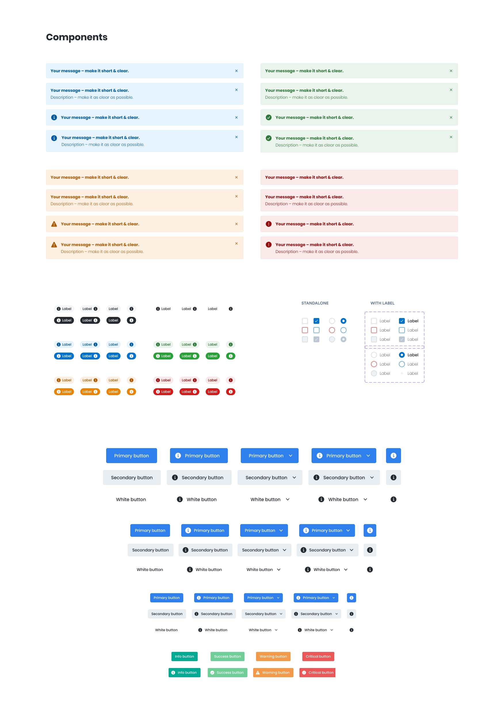

Yaquoti Workflow is an all-inclusive software designed for managing help desk operations and asset management. It offers a unified console to help desk agents and IT managers, enabling them to efficiently monitor and maintain the assets and IT requests generated by users within an organization's IT resources.

## My role 
I collaborated closely with the PMs to create visual designs, user flows, A/B testing of potential solutions, and prototypes. Additionally, I actively participated in user testing and research. Working in tandem with the front-end developers, I ensured that quality and interactions were thoroughly addressed throughout the entire process, starting from the initial concept all the way to the final implementation.

## Design Process
Product discovery and research were key. At first, I didn’t realise how big the scope of the project was, the methods that cleared that up were product analytics and competitor analysis, and they were the best for continuous product discovery. Tons of features, diagrams and docs had to be written before even considering initial ideation. 

    

A lot of sketches, wireframes and diagrams were made. Giving the scope of the project, we had many of “oh, ahaaa! And I don’t understand.” moments.

## Design Tools
Since I was the only designer at the time, it seemed only logical to adopt a design system instead of building one from scratch at that time - [Orbit Design System by Kiwi](https://www.figma.com/community/file/832549862383280158/%5BOrbit-Design-System%5D-Desktop-Web-Components) was my choice. I was already handed a couple of tasks and main features to do before even considering a culture or guidelines to follow while designing. I knew if I didn’t follow one myself, I would be wasting a lot of time, and things would definitely get messy. 

    

Some custom components 

Wasn’t one design for one person.
The system has more than just one unique user. Each user may have different permissions for what they can do or see in a single screen. That challenge opened up the door for even more research and customised UI. 

Building a data-focused ~~dashboard~~, dashboards*

Inputs, pop-up

Complex forms 

Website 
