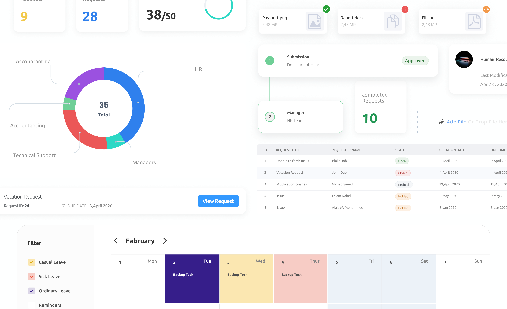

Yaquoti Workflow is an all-inclusive software designed for managing help desk operations and asset management. It offers a unified console to help desk agents and IT managers, enabling them to efficiently monitor and maintain the assets and IT requests generated by users within an organization's IT resources.

## My Role 
I collaborated closely with the PMs to create visual designs, user flows, A/B testing of potential solutions, and prototypes. Additionally, I actively participated in user testing and research. Working in tandem with the front-end developers, I ensured that quality and interactions were thoroughly addressed throughout the entire process, starting from the initial concept all the way to the final implementation.

## Design Process
Product discovery and research were key. At first, I didn’t realize how big the scope of the project was, the methods that cleared that up were product analytics and competitor analysis, and they were the best for continuous product discovery. Tons of features, diagrams and docs had to be written before even considering initial ideation. 

<figure class="img-wrapper">
    
</figure>

A lot of sketches, wireframes and diagrams were made. Givin the scope of the project, we had many “oh, ahaaa! And I don’t understand.” moments.

## Design Tools
Since I was the only designer at the time, it seemed only logical to adopt a design system instead of building one from scratch at that time - [Orbit Design System by Kiwi](https://www.figma.com/community/file/832549862383280158/%5BOrbit-Design-System%5D-Desktop-Web-Components) was my choice. I was already handed a couple of tasks and main features to do before even considering a culture or guidelines to follow while designing. I knew if I didn’t follow one myself, I would be wasting a lot of time, and things would get messy. 

<figure class="img-wrapper">
    
</figure>

## Bring it all together.

One powerful point the system has is its customization. Each user may get their unique interface. Each user may have different permissions for what they can do or see on a single screen. That challenge opened up a door for even more research and customized UI. 

<figure class="img-wrapper">
    <video playsinline="" autobuffer="" autoplay="" muted="" loop="" poster="">
    <source src="Form_builder.mp4" type="video/mp4">
    </video>
</figure>
Above, the Form Builder was one of the most powerful features I built that unlocked more space for users to make forms in any way they need. It helped in two key aspects that are:

Efficient Data Collection: Form builders enable organizations to create customized digital forms that can be easily shared with users or customers. This streamlines the process of gathering accurate and structured data, eliminating the need for manual entry and reducing the chances of errors.

Process Automation: This allows for the automation of repetitive tasks and processes triggered by form submissions, reducing manual intervention and improving efficiency.

<figure class="img-wrapper">
    
</figure>

<figure class="img-wrapper">
    
</figure>

<figure class="img-wrapper">
    
</figure>

Each request has its process of actions, conversations and decisions, and it's all stored.

<figure class="img-wrapper">
    
</figure>

Also, every request can have a different set of actions that a user can pre-select, and I had to cover all possible cases. 

<figure class="img-wrapper">
    
</figure>
## Building a data-focused ~~dashboard~~, dashboards*

Yaquoti dashboard is comprehensive and user-friendly and offers a range of solutions aimed at enhancing organizational efficiency and productivity. Through its intuitive interface, the dashboard provides real-time insights and management capabilities across various domains. With features like performance monitoring, request tracking, Yaquoti empowers businesses to streamline their processes, identify bottlenecks, and proactively address issues. The dashboard's solutions span IT service management, employee management, and more, making it an indispensable tool for businesses seeking to optimize their operations and ensure a seamless and secure digital environment.

<figure class="img-wrapper">
    
</figure>
